# GitHub Copilot Agentice Worokshop Hands-on Documents

歡迎來到 GitHub Copilot Agentice Workshop 的實作文件庫！這裡提供了三個完整的場景指南，幫助您從遺留程式碼中提取需求、轉換為新架構的規格文件，並最終更新程式碼以符合現代化標準。

## 文件清單

### 1. [場景一：舊程式碼→規格文件](./scenario-1-code-to-specification.md)

此場景用於**從既有的專案程式碼中提取需求**，並生成對應的**規格文件**。此過程不包含任何程式碼修改或重構，專注於分析現有程式碼以捕捉功能需求與行為，主要提供舊有程式碼的理解與規格撰寫指引。

**內容包括**
- 舊程式碼讀取
- 初步分析
- 功能識別
- 需求提取
- 規格文件撰寫
- 驗證與審查

**適用對象**
- 系統分析師
- 技術寫作者
- 專案經理
- 維護團隊成員

---

### 2. [場景二：規格文件→新規格文件](./scenario-2-specification-to-new-architecture.md)

此場景用於**分析現有程式碼與程式碼內的舊有規格文件**，將 .NET Framework 4.8 規格文件轉換為前後端分離架構的**移轉需求新規格文件，同時包含升級及現代化需求**，該場景不包含任何程式碼實作、IaC 部署腳本或 CI/CD 實作內容，主要提供架構轉型與需求規格的分析與撰寫指引。

**內容包括**
- 現有規格文件讀取
- 架構分析與相容性評估
- 後端遷移需求規格
- 前端需求規格
- 套件與安全性升級目標
- 服務設計與相依性注入需求
- Azure 部署需求規格
- 本地測試與驗證準則

**適用對象**
- 架構師
- 全端開發工程師
- 技術負責人
- 系統分析師

---

### 3. [場景三：規格文件→程式碼更新移轉](./scenario-3-specification-to-code.md)

此場景用於依據既有規格文件或移轉項目將既有的專案更新為 .NET 8 及 React + ASP.NET Core Web API 的前後端分離架構，並落實套件升級、跨平台與雲端部署需求。

**內容包括**
- 架構與專案格式轉換
- 前後端分離實作
- 安全性及套件更新
- 雲端部署與在地測試
- 變更驗證與完成條件、已知限制與 MSMQ 替代方案

**適用對象 / Target Audience:**
- 軟體工程師
- 系統分析師
- 技術負責人
- QA 工程師
- 維護團隊成員

---
## 實作練習
每個場景文件中均包含詳細的步驟說明與實作練習，建議依序完成三個場景以獲得完整的學習體驗。每個場景均設計為獨立模組，您可以根據需求選擇特定場景進行深入學習與實作。

### Lab 1 : Collaboration with Coding Agent
#### 1.1 將移轉需求指派給 GitHub Copilot Coding Agent 進行開發工作
- **操作重點：** 示範如何將移轉需求指派給 GitHub Copilot Coding Agent 進行程式碼更新工作
- **操作步驟**
   - 開啟 [場景三：規格文件→程式碼更新移轉](./scenario-3-specification-to-code.md)，閱讀內容並將內容複製下來
   - 於 Repository 中建立一個新的 Issue，並將複製的內容貼上
   
   - 在 Issue 頁面中的右側 Assignees 區域點選 **Assign to Copilot**，指派 GitHub Copilot Coding Agent 為該 Issue 進行開發工作
   
   - 等待 GitHub Copilot Coding Agent 完成程式碼撰寫，並於 Pull Request 頁面中查看與合併程式碼變更
   - 切換至 Coding Agent 開發時所建立的分支，點選 **Code** 並選擇 **Code Spaces** 建立 codespace 環境
   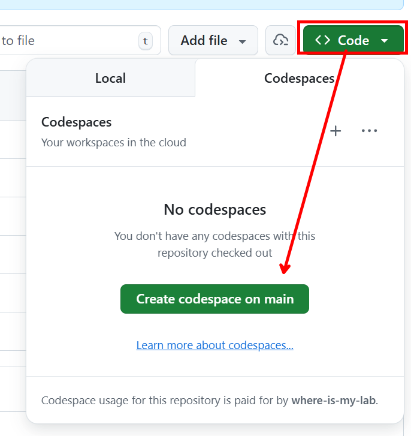
- **注意**: 程式於 codspaces 中執行因選擇較小之規格，若出現網頁反映較慢情況，或 404 錯誤，請稍待片刻或重新啟動應用程式或重新整理

#### 1.2 協助提取既有程式碼中的需求並生成規格文件
- **操作重點：** 示範如何將既有程式碼中的需求提取並生成規格文件，並指派給 GitHub Copilot Coding Agent 進行文件撰寫工作
- **操作步驟**
   - 開啟 [場景一：舊程式碼→規格文件](./scenario-1-code-to-specification.md)，並將內容複製下來
   - 於 Repository 中建立一個新的 Issue，並將複製的內容貼上
   - 在 Issue 頁面中的右側 Assignees 區域點選 **Assign to Copilot**，指派 GitHub Copilot Coding Agent 為該 Issue 進行文件撰寫工作

#### 1.3 將既有規格文件轉換為新架構的移轉需求規格文件
- **操作重點：** 示範如何將既有規格文件轉換為新架構的移轉需求規格文件，並指派給 GitHub Copilot Coding Agent 進行文件撰寫工作
- **操作步驟**
   - 於 repository 中建立一個新的分支 `docs`
        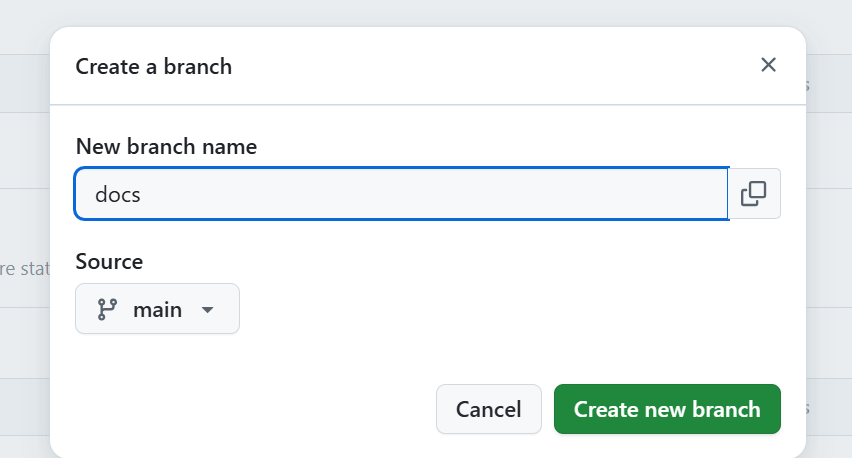
   - 修改場景一 PR 之 base branch 為 `docs` 分支
        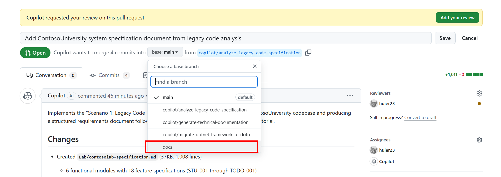
   - 進行合併 PR，將場景一 文件內容合併至 `docs` 分支
        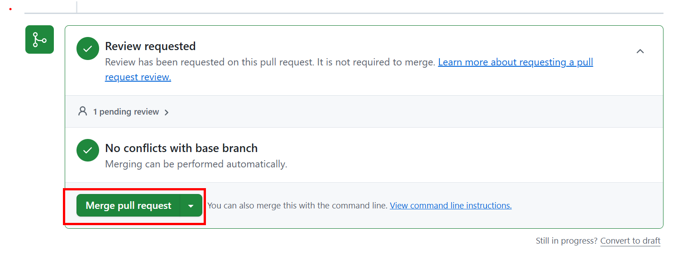
   - 開啟 [場景二：規格文件→新規格文件](./scenario-2-specification-to-new-architecture.md)，並將內容複製下來
   - 於 Repository 中建立一個新的 Issue，並將複製的內容貼上
   - 在 Issue 頁面中的右側 Assignees 區域點選 **Assign to Copilot**，點選分支 icon，選擇 `docs` 作為 base 分支，完成指派 GitHub Copilot Coding Agent 為該 Issue 進行文件撰寫工作
        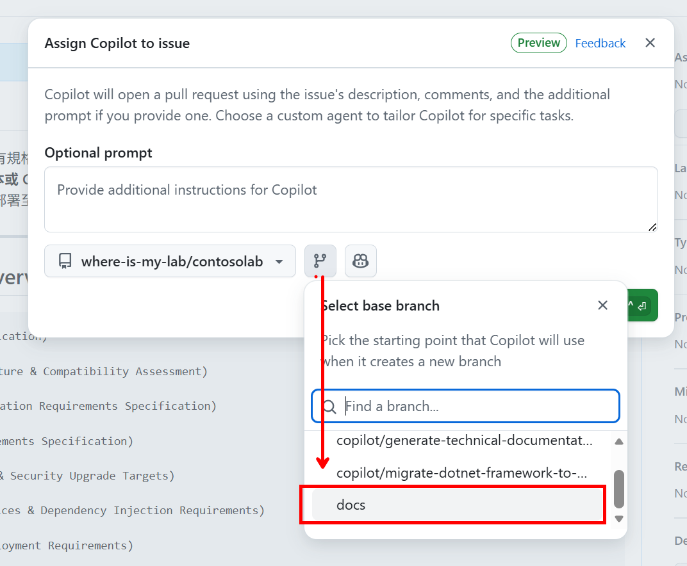
---

### Lab 2 : Make GitHub Copilot Work for You
- 於 Repository 中開啟 GitHub CCodespaces，點選 Code > Codespaces
    
#### 2.1 調整 custom instructions
- **操作重點：** 示範如何設定 GitHub Copilot 的客製化指示，透過新增通用與語言特定指示，確保 Copilot 依需求回應
- **操作步驟：**
    1. 開啟 GitHub Copilot Chat 任一模式，嘗試進行詢問
    2. 開啟 [copilot-instructions.md](../.github/copilot-instructions.md)，加入指定的回應語言區段
       ```
        ## GitHub Copilot Instructions
        - 一律使用英文回覆
        - 產生範例程式碼時，變數及函示名稱必定包含前綴 sample-
       ```
    3. 再次進行詢問，確認回應語言是否依指示更新
        ```
        請給我一段 bubble sort 的範例程式碼
        ```

#### 2.2 利用 prompt file 進行 review
- **操作重點：** 說明如何透過 Prompt 針對特定檔案生成教育性用途的註解
- **操作步驟：**
    1. 開啟 `.github/add-educational-comments.prompt.md` 並閱讀內文
    2. 啟動 GitHub Copilot Chat，選擇 **Agent** 與 **Claude Sonnet 4.5**
    3. 在現有對話中執行 **Run prompt in current chat**，依據提示內容進行回應需要針對的檔案進行註解
    4. 檢視回應內容，確認是否符合需求

#### 2.3 利用 custom agent 進行特定情境之任務
- **操作重點：** 使用專屬聊天模式來進行提示詞優化，幫助使用者釐清提示協助提升提示品質並取得更佳的回應
- **操作步驟：**
    1. 在 Chat 模式選擇 **prompt-engineer**，模型選擇 **Claude Sonnet 4.5**
    2. 輸入模糊的提示：`我需要進行升級` 輸出應包含分析後更加精確之提示詞

---

### Lab 3 : GitHub Copilot - your personal AI-assistant for development
- 確認 情境三之程式碼更新移轉已完成後，於 Codespaces 中切換至該分支
    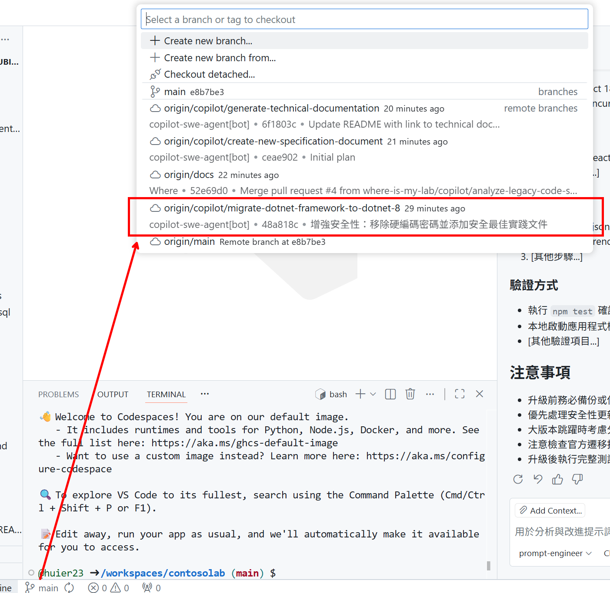
#### 3.1 使用 Agent 模式實作移轉後確認
- **操作重點：** 利用 Agent Mode 進行移轉驗證並修復問題
- **操作步驟：**
    1. 選擇 `Agent` chat mode，並選擇模型 `Claude Sonnet 4.5`
    2. 輸入提示詞 `安裝 .NET 8` 進行 .NET 8 安裝
    3. 安裝完成後可參考生成之指令進行專案建置與執行，須注意至少需確認以下有執行
        - 啟動 sql server container，並確認正常運行
        - 確認 `appsettings.Development.json` 中之資料庫連線字串正確指向 sql server container 且密碼正確
        - 於移轉後的專案目錄執行 `dotnet restore` 及 `dotnet build` 成功
    4. 執行 `dotnet run` 後，開啟瀏覽器並連線至提供的 endpoint 進行功能測試
    5. (Option) 若出現 waring: Dereference of a possibly null reference 可藉由 Agent 協助修復
        ```
        #terminalSelection 修復 warning
        ```
        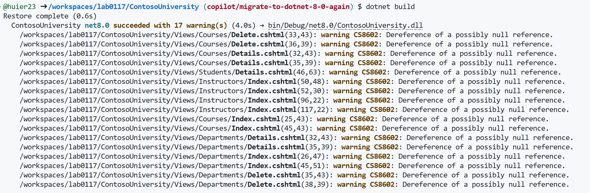
    6. (Option) 若於新增學生資料時出現日期錯誤如 `Enrollment date must be between 1753 and 9999`，請利用 Agent 協助進行偵錯與修復
        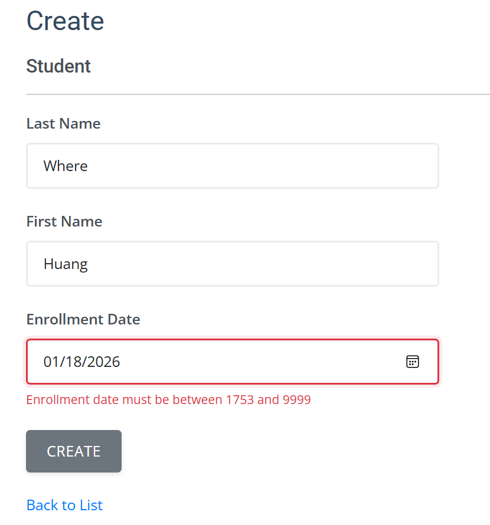
        - 使用 prompt `在新增學生資料時，選擇日期後會出現 Enrollment date must be between 1753 and 9999，進行修復`，並可利用 vision 功能提供截圖
        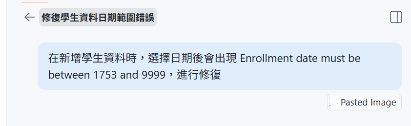
    7. 查看 `Scripts/` 了解 Azure 資源部屬腳本及 `.github/workflows/deploy-to-azure.yml` 了解 CI/CD 自動化部署流程
        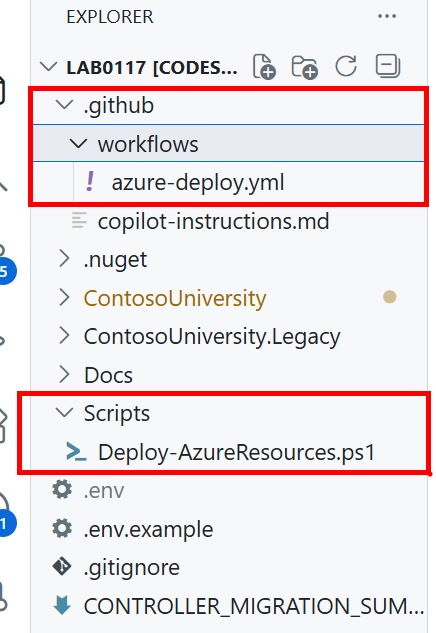
#### 3.2 利用 GitHub Copilot 進行 code review
- **示範重點：** 示範如何結合 Git 流程啟動 Copilot Code Review
- **目的：** 確保程式變更已整理並交付給 Copilot 進行自動化審查
- **操作方式：**
    1. 透過 VS Code 介面開啟 Source Control 視窗
    2. 點選 comit 欄位上方的 **Copilot Code Review**，逐步檢視建議，可選擇：
        - Code Review - Unstaged Change
            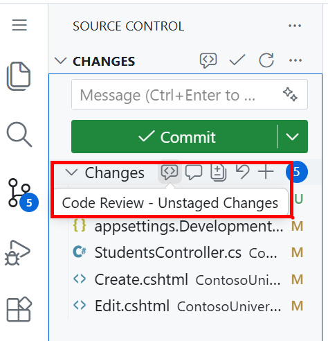
        - Code Review - Staged Change
            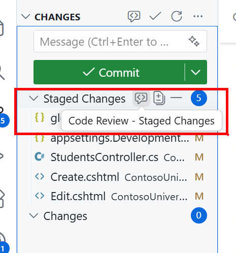
    3. 根據 Copilot Code Review 建議進行程式碼修改，完成改動後提交程式碼至遠端儲存庫

### Lab 4 : Collaboration
- 回到 Repository 主頁面，點選回先前 Coding Agent 所建立之 PR，選擇 Ready for review

- 在頁面的最上方找到 Reviewers，選擇 Copilot 作為程式碼審查者
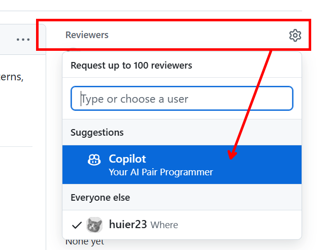
- 等待 Copilot 進行程式碼評審