# GitHub Copilot Agentice Worokshop Hands-on Documents

歡迎來到 GitHub Copilot Agentice Workshop 的實作文件庫！這裡提供了三個完整的場景指南，幫助您從遺留程式碼中提取需求、轉換為新架構的規格文件，並最終更新程式碼以符合現代化標準。

## 文件清單

### 1. [場景一：舊有程式碼轉規格文件](./scenario-1-legacy-code-to-spec.md)

此場景用於**從既有的專案程式碼中提取需求**，並生成對應的**規格文件**。此過程不包含任何程式碼修改或重構，專注於分析現有程式碼以捕捉功能需求與行為，主要提供舊有程式碼的理解與規格撰寫指引。

**適用對象**
- 系統分析師
- 技術寫作者
- 專案經理
- 維護團隊成員

---

### 2. [場景二：舊有規格轉新規格文件](./scenario-2-spec-to-new-architecture.md)

此場景用於**分析現有程式碼與程式碼內的舊有規格文件**，將 .NET Framework 4.8 規格文件轉換為前後端分離架構的**移轉需求新規格文件，同時包含升級及現代化需求**，該場景不包含任何程式碼實作、IaC 部署腳本或 CI/CD 實作內容，主要提供架構轉型與需求規格的分析與撰寫指引。

**適用對象**
- 架構師
- 全端開發工程師
- 技術負責人
- 系統分析師


### [場景三：規格文件→程式碼更新移轉](./scenario-3-specification-to-code.md)

此場景用於依據既有規格文件或移轉項目將既有的專案更新為 .NET 8 及 React + ASP.NET Core Web API 的前後端分離架構，並落實套件升級、跨平台與雲端部署需求。

**適用對象:**
- 軟體工程師
- 系統分析師
- 技術負責人
- QA 工程師
- 維護團隊成員

---
## 實作練習

### Lab 1 : Collaboration with Coding Agent
#### 1.1 將移轉需求指派給 GitHub Copilot Coding Agent 進行開發工作
- **操作重點：** 示範如何將移轉需求指派給 GitHub Copilot Coding Agent 進行程式碼更新工作
- **操作步驟**
   - 開啟 [場景三：規格文件→程式碼更新移轉](./scenario-3-specification-to-code.md)，閱讀內容並將內容複製下來
   - 於 Repository 中建立一個新的 Issue，並將複製的內容貼上
        
        
   - 在 Issue 頁面中的右側 Assignees 區域點選 **Assign to Copilot**，指派 GitHub Copilot Coding Agent 為該 Issue 進行開發工作
        
        
   - 等待 GitHub Copilot Coding Agent 完成程式碼撰寫，並於 Pull Request 頁面中查看與合併程式碼變更
   - 切換至 Coding Agent 開發時所建立的分支，點選 **Code** 並選擇 **Code Spaces** 建立 codespace 環境
        
        
- **注意**: 程式於 codspaces 中執行因選擇較小之規格，若出現網頁反映較慢情況，或 404 錯誤，請稍待片刻或重新啟動應用程式或重新整理

#### 1.2 協助提取既有程式碼中的需求並生成規格文件
- **操作重點：** 示範如何將既有程式碼中的需求提取並生成規格文件，並指派給 GitHub Copilot Coding Agent 進行文件撰寫工作
- **操作步驟**
   - 開啟 [場景一：舊有程式碼轉規格文件](./scenario-1-legacy-code-to-spec.md)，並將內容複製下來
   - 於 Repository 中建立一個新的 Issue，並將複製的內容貼上
   - 在 Issue 頁面中的右側 Assignees 區域點選 **Assign to Copilot**，指派 GitHub Copilot Coding Agent 為該 Issue 進行文件撰寫工作

#### 1.3 將既有規格文件轉換為新架構的移轉需求規格文件
- **操作重點：** 示範如何將既有規格文件轉換為新架構的移轉需求規格文件，並指派給 GitHub Copilot Coding Agent 進行文件撰寫工作
- **操作步驟**
   - 開啟 [場景二：舊有規格轉新規格文件](./scenario-2-spec-to-new-architecture.md)，並將內容複製下來
   - 於 Repository 中建立一個新的 Issue，並將複製的內容貼上
   - 在 Issue 頁面中的右側 Assignees 區域點選 **Assign to Copilot**
   - 點選分支 icon，選擇 `copilot/legacy-to-spec` 作為 base 分支，完成指派 GitHub Copilot Coding Agent 為該 Issue 進行文件撰寫工作
        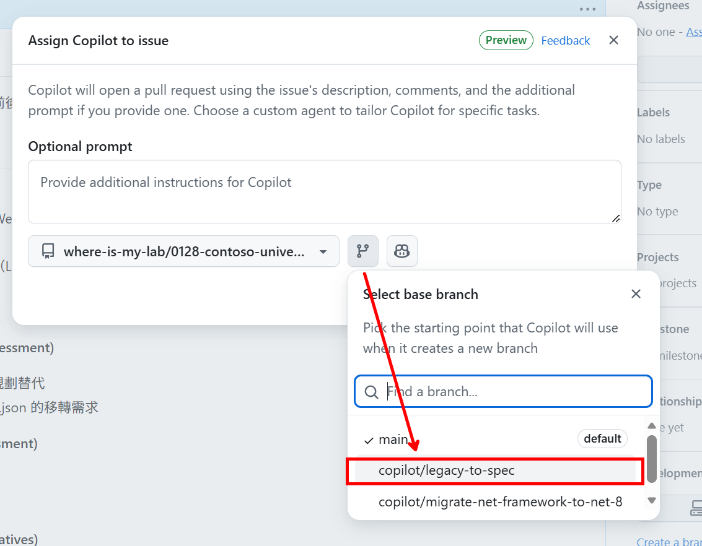

---
### Lab 2 : GitHub Copilot - your personal AI-assistant for development
#### 2.1 建立 GitHub Copilot Codespace 環境
- 確認程式碼更新移轉已完成後，透過 PR 頁面切換至該分支或透過 Repo 畫面直接切換
    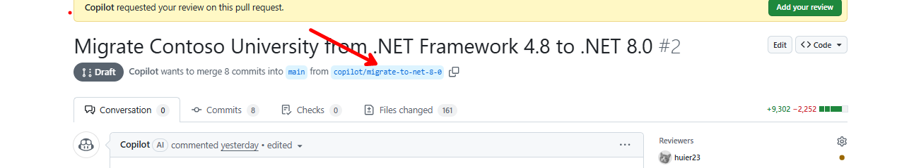
- 點選 **Code** 並選擇 **Code Spaces**，點選 **New with Option** 建立 codespace 環境
    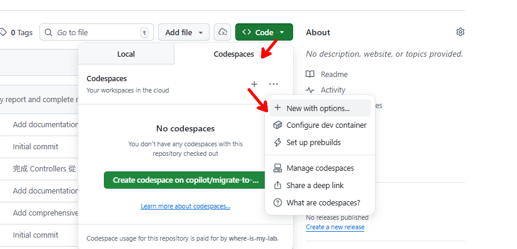
- 確認 Branch 為剛剛 Coding Agent 所建立之分支並選擇 4-core 規格
    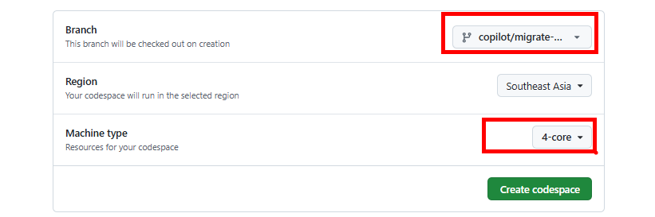
#### 2.2 使用 Agent 模式實作移轉後確認
- **操作重點：** 利用 Agent Mode 進行移轉驗證並修復問題
- **操作步驟：**
    1. 選擇 `Agent` chat mode，並選擇模型 `Claude Sonnet 4.5`
    2. 輸入提示詞 `安裝 .NET 8` 進行 .NET 8 安裝
    3. 安裝完成後可參考生成之指令進行專案建置與執行，須注意至少需確認以下有執行
        - 啟動 sql server container，並確認正常運行
        - 確認 `appsettings.Development.json` 中之資料庫連線字串正確指向 sql server container 且密碼正確
        - 於移轉後的專案目錄執行 `dotnet restore` 及 `dotnet build` 成功
    4. 執行 `dotnet run` 後，開啟瀏覽器並連線至提供的 endpoint 進行功能測試
    5. (Option) 若出現 waring: Dereference of a possibly null reference 可藉由 Agent 協助修復
        ```
        #terminalSelection 修復 warning
        ```
        
        
    6. (Option) 若於新增學生資料時出現日期錯誤如 `Enrollment date must be between 1753 and 9999`，請利用 Agent 協助進行偵錯與修復
        
        
        - 使用 prompt `在新增學生資料時，選擇日期後會出現 Enrollment date must be between 1753 and 9999，進行修復`，並可利用 vision 功能提供截圖
            
            
    7. 查看 `Scripts/` 了解 Azure 資源部屬腳本及 `.github/workflows/deploy-to-azure.yml` 了解 CI/CD 自動化部署流程
        
        

#### 2.3 使用 Agent Mode 進行功能微調
- **示範重點：** 利用 Agent Mode 進行功能調整
- **操作方式：**
    1. 選擇 `Agent` chat mode，並選擇模型 `Claude Sonnet 4.5`
    2. 輸入提示詞 `更新首頁標題從 Contoso University 為 Contoso Lab University` ，使用拖曳方式將 `ContosoUniversity` 資料夾拖曳至 Copilot Chat 對話框提供程式碼參考
        
        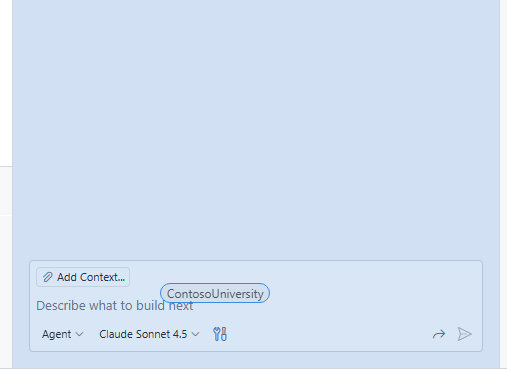
    3. 檢視 copilot 修改結果並測試
        
        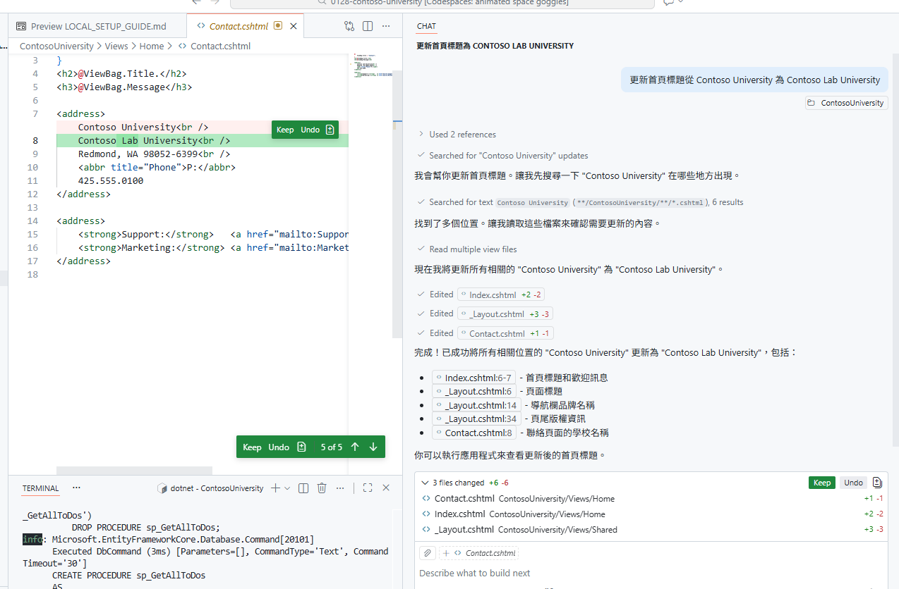

#### 2.4 利用 GitHub Copilot 於 IDE 進行 code review
- **示範重點：** 示範如何結合 Git 流程啟動 Copilot Code Review
- **目的：** 確保程式變更已整理並交付給 Copilot 進行自動化審查
- **操作方式：**
    1. 透過 VS Code 介面開啟 Source Control 視窗
    2. 點選 comit 欄位上方的 **Copilot Code Review**，逐步檢視建議，可選擇：
        - Code Review - Unstaged Change
            
            
        - Code Review - Staged Change
            
            
    3. 根據 Copilot Code Review 建議進行程式碼修改，完成改動後提交程式碼至遠端儲存庫
    4. 提交完成後，於 GitHub Repository 頁面中查看 Pull Request，確認已有個人一筆提交紀錄
        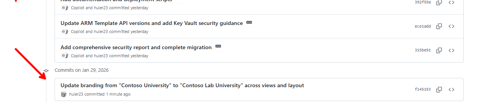

### Lab 3 : Collaboration
- 回到 Repository 主頁面，點選回先前 Coding Agent 所建立之 PR，選擇 Ready for review
    
    
- 在頁面的最上方找到 Reviewers，選擇 Copilot 作為程式碼審查者
    
    
- 等待 Copilot 進行程式碼評審

    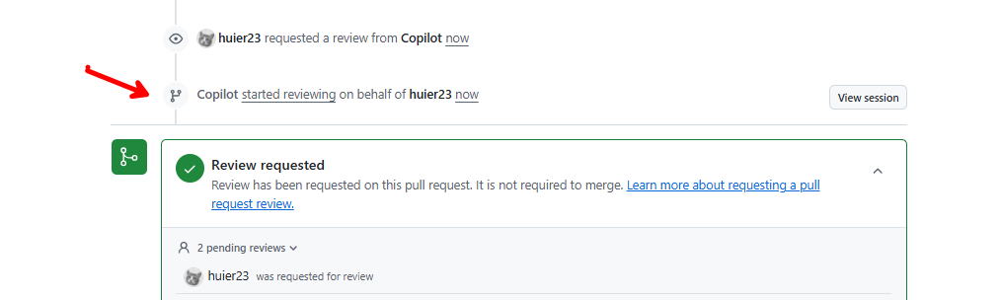

- 查看 Copilot 回覆，判斷是否接受該建議

    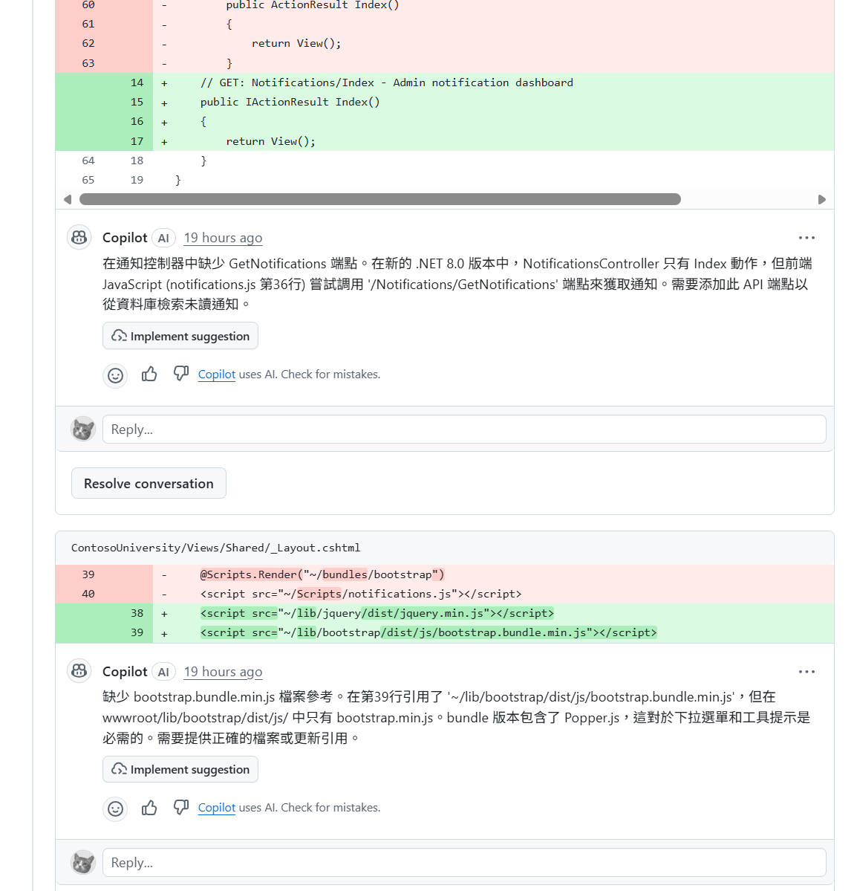
- Merge 前可選擇 Squash and merge 以整理提交紀錄

    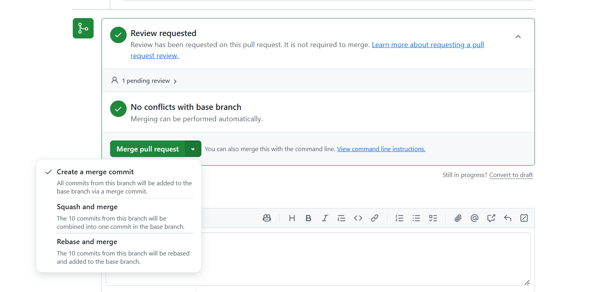
- 完成合併後，刪除分支以保持儲存庫整潔並清除 codespace 環境
    1. 清除功能性分支
    
        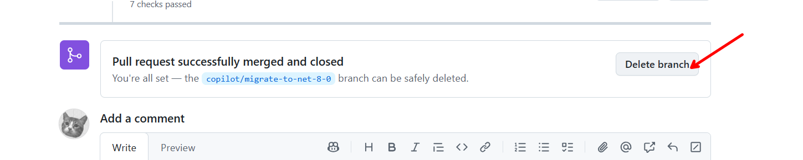
    2. 刪除 Codespace 環境
        
        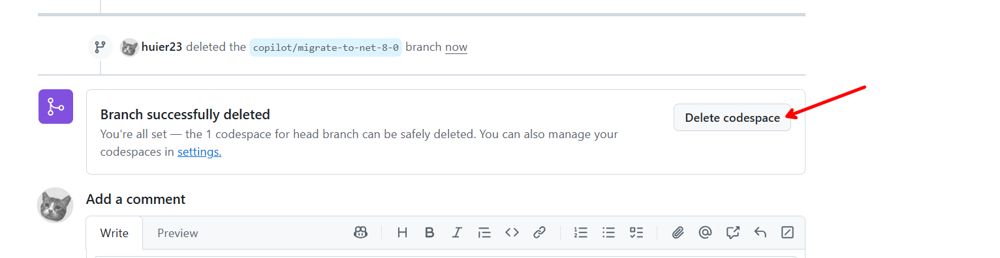
