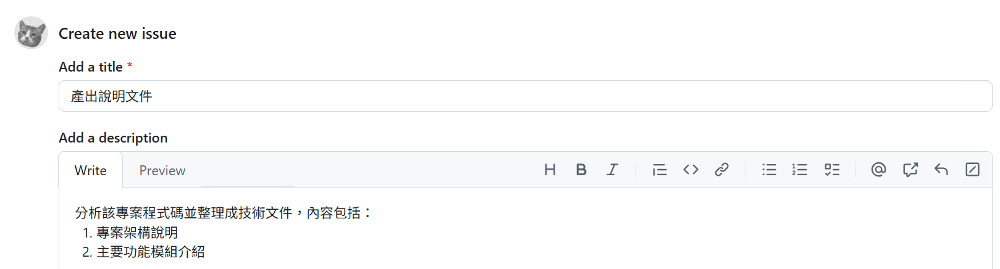
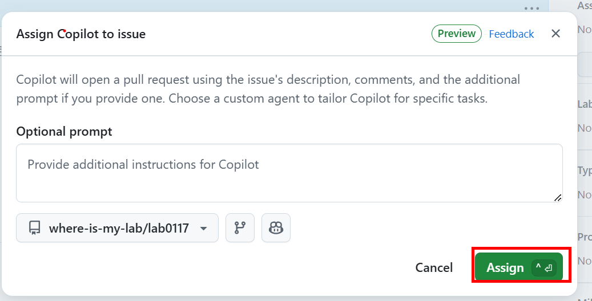
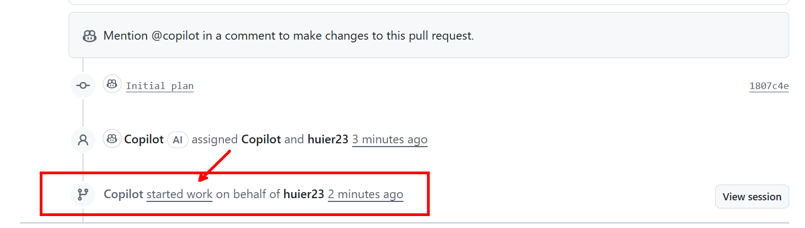
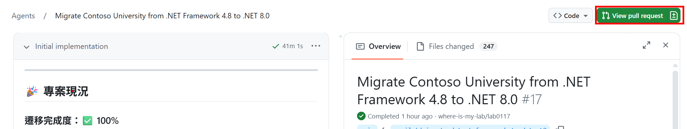

# Tutorial for Setup
## 指派 GitHub Copilot Coding Agent 進行工作任務
- **操作重點：** 示範如何將 Issue 指派給 GitHub Copilot Coding Agent 進行程式碼任務工作
- **操作步驟**
   - 複製以下內容
        ```
        整理該程式碼專案的技術文件，內容包括：
        1. 專案架構說明
        2. 主要功能模組介紹
        3. 開發與部署流程
        4. 使用的主要技術與工具
        5. 常見問題與解決方案
        ```
   - **該步驟用於確認可正常建立 Issue**: 於 Repository 中建立一個新的 Issue，並將複製的內容貼上

        
        

   - **該步驟用於確認可指派 Coding Agent 進行工作**: 在 Issue 頁面中的右側 Assignees 區域點選 **Assign to Copilot**，指派 Coding Agent 為該 Issue 進行開發工作

        
        

   - **該步驟用於確認 Coding Agent 可運行**: 
        - 於建立的 Issue 頁面中，點選 `[WIP] xxxxx` 標題進入 Pull Request 頁面
            
        - 於 Pull Request 頁面中找到 `Copilot started work on behalf of xxxx` 訊息，點選 **started work** 可進入 coding agent 運行頁面
            
        - 等待 GitHub Copilot Coding Agent 完成文件撰寫，並於 Pull Request 頁面中查看與合併程式碼變更
            
            
   - **該步驟用於確認可正常建立 GitHub Codespaces 環境**: 切換至 Coding Agent 開發時所建立的分支，點選 **Code** 並選擇 **Code Spaces** 建立 codespace 環境
    
        